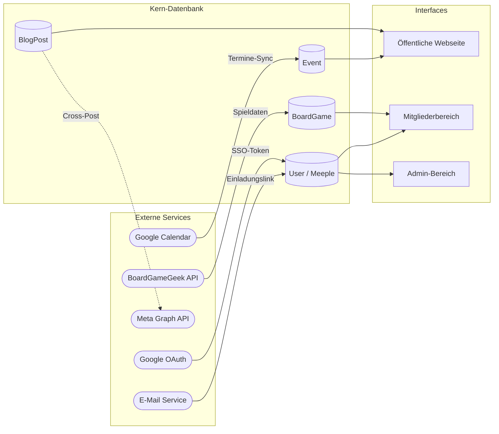
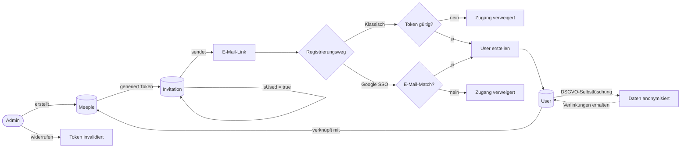
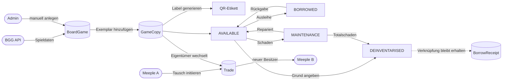
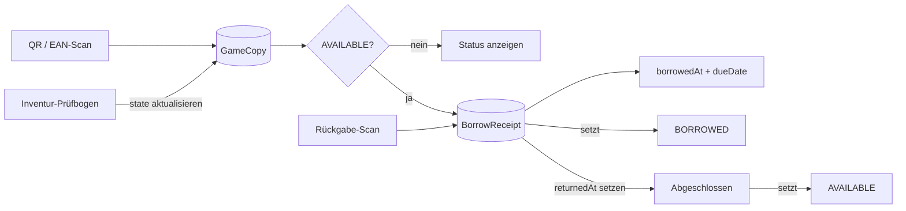
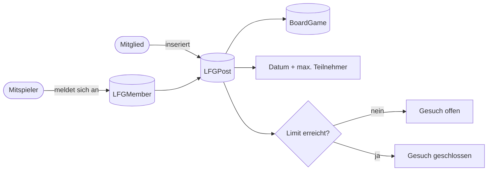
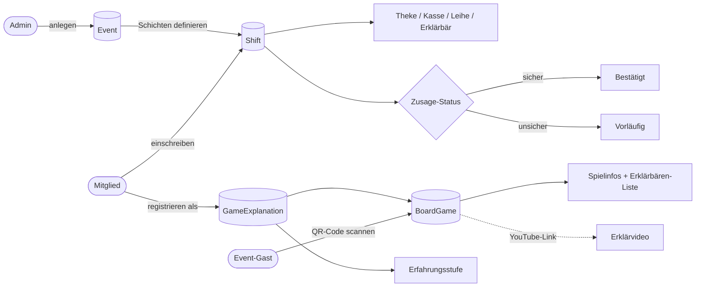
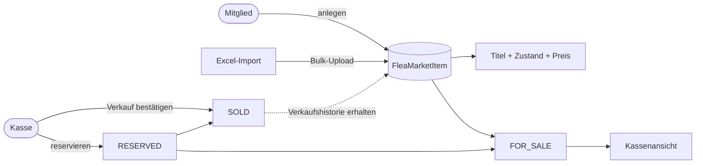

# Datenfluss-Diagramme

Zentrale Datenflüsse des Oecher Meeples Vereinsportals, gegliedert nach funktionalen Bereichen.

---

## 1. Systemübersicht

---

## 2. Onboarding & Authentifizierung

---

## 3. Blog-Erstellung & Instagram Cross-Posting

---

## 4. Spielekatalog & Deinventarisierung

---

## 5. Ausleihvorgang

---

## 6. Spielergesuche

---

## 7. Event-Betrieb & Helferplan

---

## 8. Bring & Buy Flohmarkt

