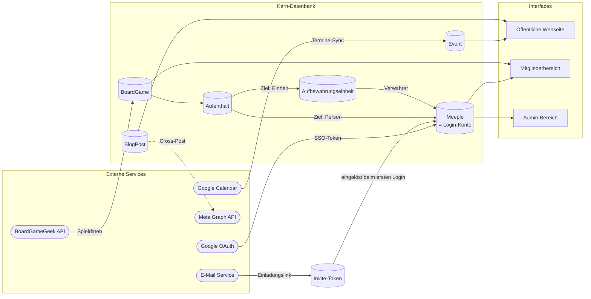
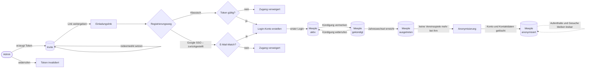
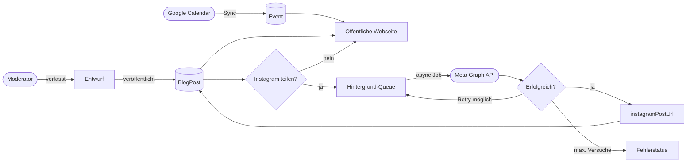
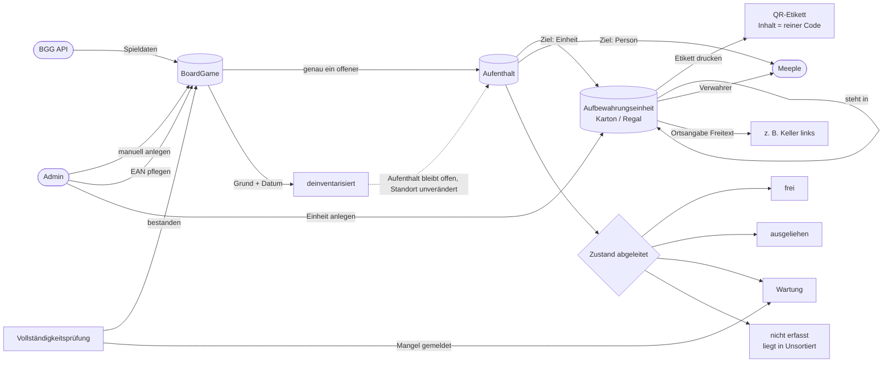
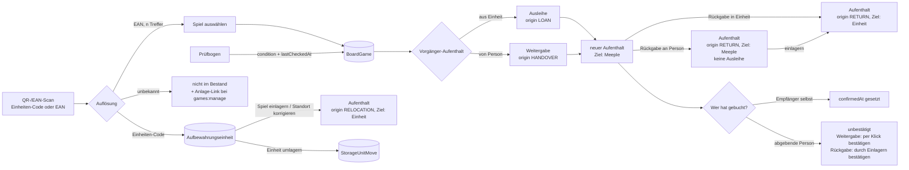
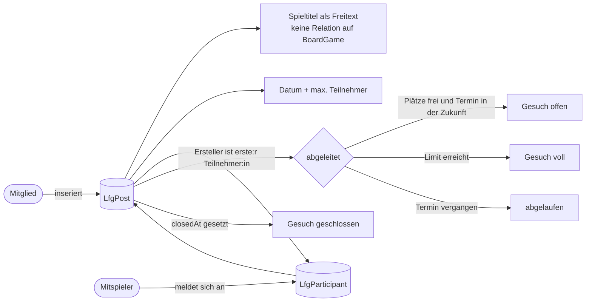

# Datenfluss-Diagramme

Zentrale Datenflüsse des Oecher Meeples Vereinsportals, gegliedert nach funktionalen Bereichen.

---

## 1. Systemübersicht

> Ein `Meeple` ist dasselbe Objekt wie das Login-Konto, kein zweiter Personendatensatz — siehe [ADR 0002](adr/0002-meeple-eins-zu-eins-zum-login.md).

---

## 2. Onboarding & Mitgliedschafts-Lebenszyklus

Vor der Registrierung existiert **kein** Meeple — der Einladungslink ist ein reines Token ohne Personenbezug, der Meeple entsteht beim ersten Login.

> Die Zustände `aktiv` / `gekündigt` / `ausgetreten` / `anonymisiert` werden aus `resignedAt`, `membershipEndsAt` und `anonymizedAt` **abgeleitet**, nicht gespeichert.

---

## 3. Blog-Erstellung & Instagram Cross-Posting

---

## 4. Spielekatalog, Aufbewahrung & Deinventarisierung

Ein Datensatz pro physischem Spiel — keine getrennte Exemplar-Ebene. Etiketten hängen an den **Aufbewahrungseinheiten**, nicht an den Spielen; die EAN kennzeichnet das Produkt und ist deshalb nicht eindeutig. Begründung: [ADR 0001](adr/0001-ludothek-aufenthalte-statt-exemplare.md).

---

## 5. Aufenthalte: Ausleihe, Rückgabe, Weitergabe, Umlagern

Alle vier Vorgänge sind derselbe Schreibvorgang — den offenen Aufenthalt schließen, den nächsten öffnen. Es gibt **keine Leihfrist**.

---

## 6. Spielergesuche

---

## 7. Event-Betrieb & Helferplan

---

## 8. Bring & Buy Flohmarkt

