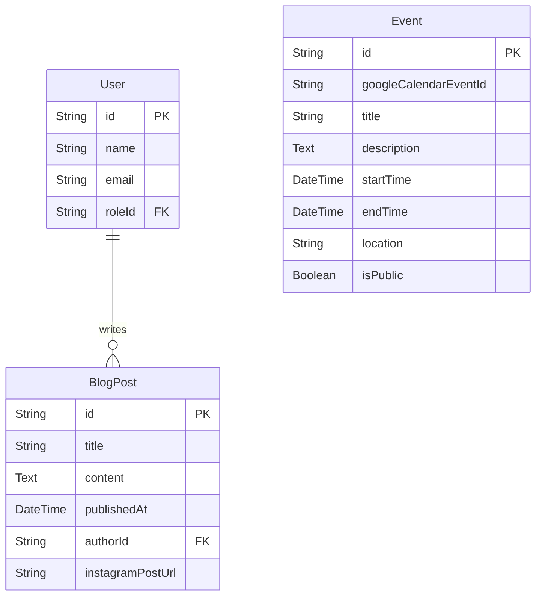
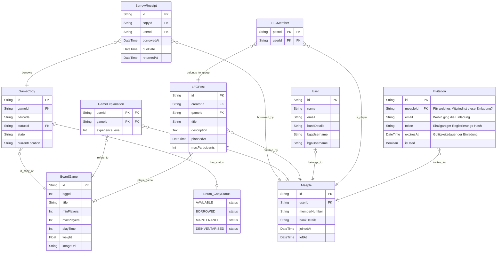
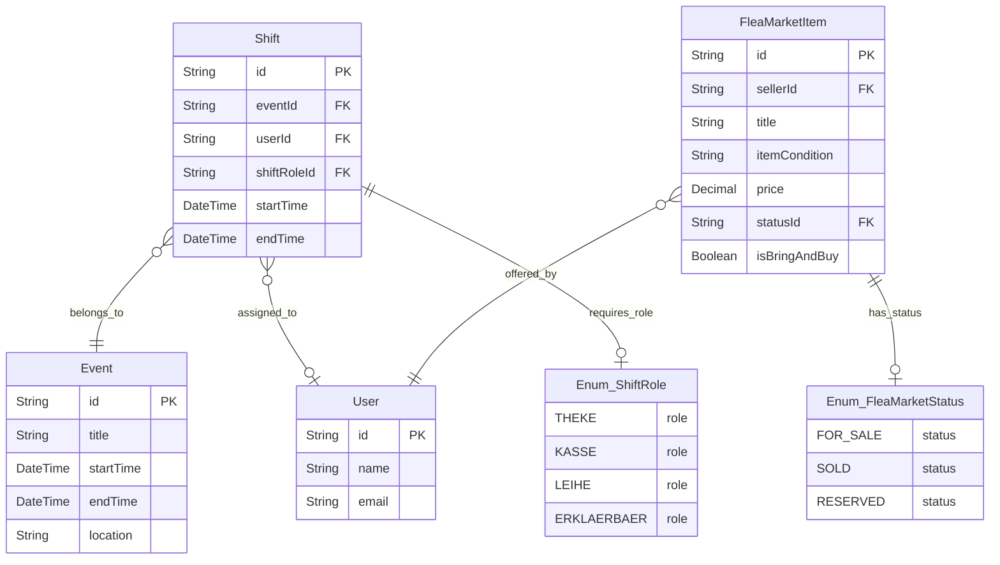

# 📊 Systemarchitektur & Datenmodelle

Dieses Dokument beschreibt die aufgeteilte Datenbankarchitektur für die Plattform der *Oecher Meeples Ludothek*. Das gesamte Datenmodell ist in drei funktionale Module unterteilt, um eine klare Strukturierung der API-Endpunkte und eine einfache Erweiterbarkeit während der Entwicklung zu garantieren.

---

## 1. Öffentlicher Bereich (Public Area)

### Beschreibung

Das Datenmodell für den öffentlichen Bereich bildet die Grundlage für alle Interaktionen von nicht-angemeldeten Besuchern der Webseite. Dieses Modul steuert die allgemeinen redaktionellen Inhalte und die Außendarstellung des Vereins.

Es verwaltet die Basis-Metadaten von Benutzern, die als Autoren für Blogeinträge fungieren, die eigentlichen Blogposts (inklusive Verknüpfungen zu externen Plattformen wie Instagram) sowie die offiziellen Vereinstermine, welche über Schnittstellen wie die Google Calendar API synchronisiert werden können.

### Diagramm

---

## 2. Mitgliederbereich (Members Area)

### Beschreibung

Der Mitgliederbereich umfasst alle Datenstrukturen, die nur für authentifizierte Vereinsmitglieder nach einem Login zugänglich sind. Dieser Abschnitt steuert die sichere Profilverwaltung, vereinsinterne Finanzdaten (z. B. für Mitgliedsbeiträge) sowie die Anbindung an externe Brettspiel-Datenbanken (BoardGameGeek und BoardGameArena).

Zusätzlich ist hier das komplette Verleihsystem der Ludothek verankert. Es verknüpft den globalen Spielekatalog mit den physisch im Verein vorhandenen Exemplaren (`GameCopy`), protokolliert die Ausleihvorgänge, verwaltet das Wissen der Spieleerklärer (`GameExplanation`) und steuert die integrierte Spielersuche (`LFGPost`).

### Diagramm

---

## 3. Events & Vor-Ort-Betrieb (Events & Operations)

### Beschreibung

Dieses Teilschema koordiniert die Logistik vor Ort während der Spieletreffs und steuert den schulinternen Sekundärmarkt des Vereins. Es konzentriert sich auf den physischen Betrieb bei Veranstaltungen.

Hierzu gehört die Personal- und Helferplanung über ein Schichtsystem, bei dem den Mitgliedern spezifische Aufgabenbereiche (Kasse, Theke, Spieleausleihe) über vordefinierte Rollen (`Enum_ShiftRole`) zugewiesen werden. Gleichzeitig wird hierüber der "Bring & Buy Flohmarkt" abgebildet, um den Zustand, die Besitzverhältnisse und die Preise der zum Verkauf stehenden Spiele lückenlos zu überwachen.

### Diagramm

