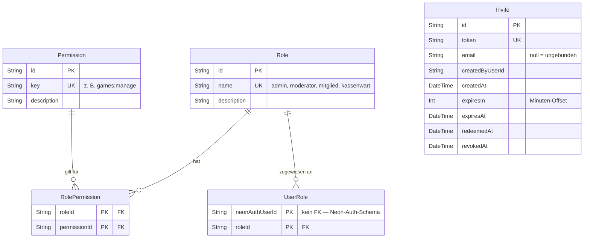
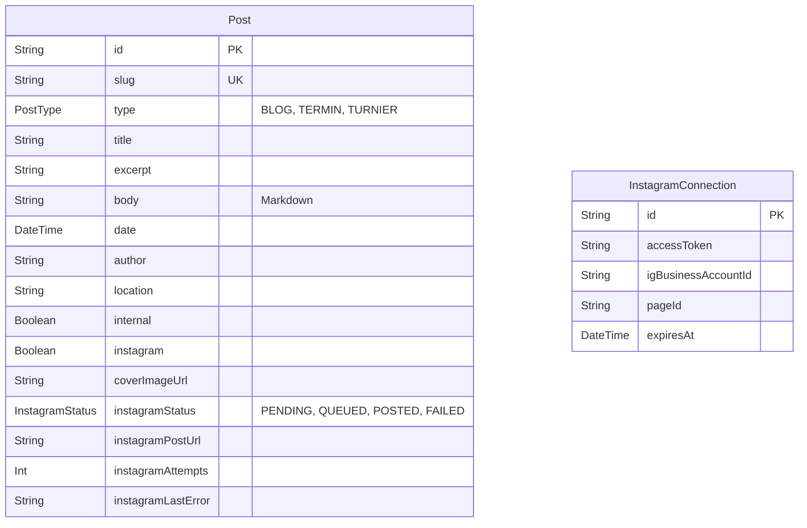
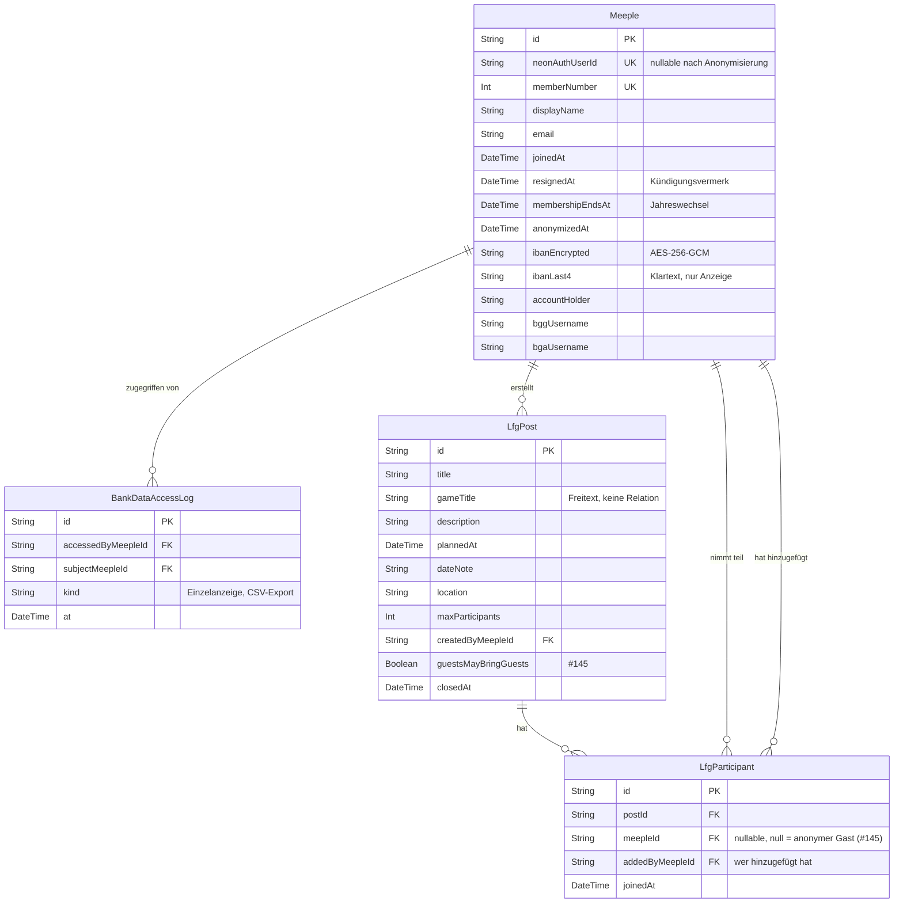
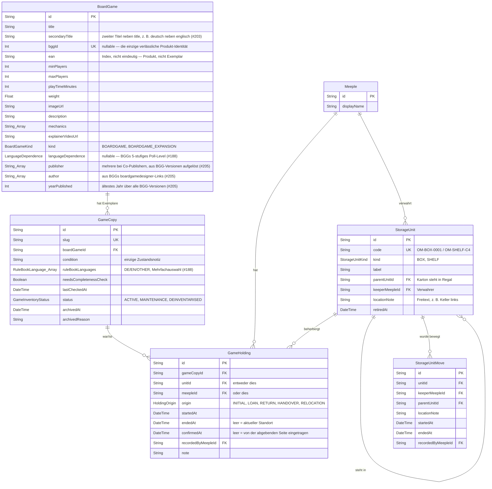
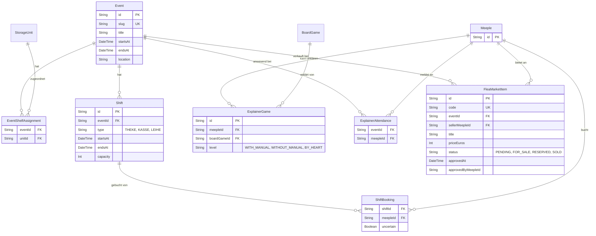

# 📊 Datenmodell

Beschreibt das Datenmodell der Plattform der *Oecher Meeples Ludothek*. Maßgeblich ist [`prisma/schema.prisma`](../prisma/schema.prisma) — dieses Dokument erklärt Zusammenhänge, die dort nicht sichtbar sind.

Jede Tabelle ist mit ihrem Stand markiert:

- **✅ migriert** — existiert in der Datenbank
- **🔜 Phase 5** — beschlossen, noch nicht migriert (siehe `.claude/plans/phase-5-mitglieder-scan-execution-plan.md`)
- **📋 später** — nur Skizze, Details noch offen

Die Fachsprache (Meeple, Aufenthalt, Aufbewahrungseinheit, Ausleihe, Weitergabe, …) definiert [`CONTEXT.md`](../CONTEXT.md) und ist im Code verbindlich.

---

## 1. Benutzer und Berechtigungen

**Benutzerkonten liegen nicht in diesem Schema.** Authentifizierung läuft über Neon Auth, die Konten liegen im separaten DB-Schema `neon_auth."user"`. Prisma kann darauf keinen Fremdschlüssel setzen — die Verknüpfung ist überall ein reines String-Feld (`neonAuthUserId`). Rollen und Rechte liegen dagegen in diesem Schema, damit sie ohne Abhängigkeit vom Auth-Anbieter erweiterbar sind.

Berechtigungen sind **nicht** als Rollen-Rangordnung modelliert, sondern als Permissions, die Rollen zugeordnet werden. Eine Person kann mehrere Rollen haben; geprüft wird immer die Permission, nie die Rolle.

| Tabelle | Stand |
|---|---|
| `permissions`, `roles`, `role_permissions`, `user_roles` | ✅ migriert |
| `invites` | ✅ migriert |
| Rolle `kassenwart` + Permission `bank:read` (Seed) | ✅ migriert |

Eine Einladung (`Invite`) gibt es in zwei Ausprägungen, unterschieden allein über `email`: **gebunden** (`email` gesetzt, lowercased) ist genau einmal einlösbar und muss beim Einlösen case-insensitiv mit der eingegebenen E-Mail übereinstimmen; **ungebunden** (`email = null`, in der Admin-Oberfläche als „\*" angezeigt) ist beliebig oft einlösbar bis Ablauf oder Widerruf, ohne Protokollierung von `redeemedAt`. `expiresIn` speichert die vom Admin gewählte Gültigkeitsdauer als Minuten-Offset, damit „Verlängern" sie später erneut anwenden kann. Wer eine Einladung einlöst, wird dadurch Mitglied — es gibt keinen Mitgliedsdatensatz vor der Registrierung.

---

## 2. Redaktionelle Inhalte

Blogbeiträge und Termine liegen in **einer** Tabelle, unterschieden über `type`. Der Beitragstext ist Markdown. Termine kommen zusätzlich aus einem öffentlichen ICS-Feed und werden nicht persistiert — nur redaktionell angelegte Termine liegen in `posts`.

`internal` markiert Beiträge, die nur eingeloggte Mitglieder sehen. Die Instagram-Spalten bilden eine Warteschlange ohne externen Queue-Dienst ab: `instagramStatus` wird von einem täglichen Cron-Job abgearbeitet, `instagramAttempts` begrenzt die Wiederholungen.

| Tabelle | Stand |
|---|---|
| `posts` | ✅ migriert |
| `instagram_connections` | ✅ migriert |

`InstagramConnection` hält genau eine Verbindung für den Vereins-Account; das Long-Lived-Token wird täglich erneuert.

---

## 3. Mitglieder

Ein `Meeple` ist das Mitgliedsprofil und entspricht 1:1 einem Login-Konto. Der Mitgliedschaftszustand wird **aus Datumsfeldern abgeleitet**, nicht gespeichert: aktiv → gekündigt (`resignedAt` gesetzt, `membershipEndsAt` in der Zukunft) → ausgetreten (`membershipEndsAt` erreicht) → anonymisiert.

Bei der Anonymisierung wird das Auth-Konto gelöscht und der `Meeple` behält nur, was die Historie lesbar hält — deshalb ist `neonAuthUserId` nullable, obwohl sonst jedes Profil ein Konto hat.

Die IBAN liegt mit AES-256-GCM verschlüsselt (`ibanEncrypted`); `ibanLast4` liegt im Klartext, damit Listen ohne Entschlüsselung anzeigen können. Jeder entschlüsselte Zugriff erzeugt einen Eintrag in `BankDataAccessLog`.

| Tabelle | Stand |
|---|---|
| `meeples` | ✅ migriert |
| `bank_data_access_logs` | ✅ migriert |
| `lfg_posts`, `lfg_participants` | ✅ migriert |

`LfgPost.gameTitle` ist bewusst Freitext statt einer Relation auf `BoardGame`: Gesuche sollen auch für Spiele möglich sein, die dem Verein nicht gehören. „Voll" und „abgelaufen" werden aus `maxParticipants` und `plannedAt` berechnet, nicht gespeichert.

`LfgParticipant.meepleId` ist nullable — `null` markiert einen anonymen Gast (#145). Der eigene `id`-PK (statt Composite-PK) macht das möglich, da mehrere Gäste pro Gesuch sonst mit `meepleId = null` kollidieren würden. `addedByMeepleId` (immer gesetzt) ist die einzige Quelle für den Anzeigenamen eines Gasts ("Gast von {Name}") — nie Freitext.

---

## 4. Ludothek: Bestand, Aufbewahrung, Verleih

### Titel und Exemplar getrennt (ADR 0008)

`BoardGame` ist der **Titel** — reine BGG-/Produkt-Metadaten, ein Datensatz pro Titel unabhängig davon, wie viele physische Exemplare der Verein davon besitzt. `bggId` ist deshalb `@unique` (nullable). `GameCopy` ist das **Exemplar**: Zustand (`condition`), Inventarstatus, Vollständigkeitsprüfung, Deinventarisierung — alles, was sich pro physischem Spiel unterscheidet. Ein Titel kann beliebig viele Exemplare haben (`GameCopy.boardGameId`, `onDelete: Restrict` — ein Titel mit noch existierenden Exemplaren kann nicht versehentlich mitgelöscht werden). `ean` bleibt auf dem Titel und **nicht eindeutig**: die EAN kennzeichnet das Produkt, nicht das einzelne Exemplar — mehrere Exemplare desselben Titels tragen dieselbe EAN.

Diese Trennung löst den Teil von ADR 0001 ab, der sie ursprünglich verwarf ("nicht wieder vorschlagen, ohne dass es echte Duplikate gibt") — echte Mehrfach-Exemplare (Vereinsbibliothek) und private BGG-Sammlungen (`PrivateGameCollectionEntry`, referenziert ebenfalls den Titel) haben diese Bedingung erfüllt.

`GameCollection` (Grundspiel↔Erweiterung), `ExplainerGame` und `SparePartListing` bleiben auf Titel-Ebene — eine Erweiterung, ein Erklärbär-Profil oder ein Ersatzteil gehört zum Titel, nicht zum einzelnen Exemplar.

Deinventarisierte Exemplare werden nie gelöscht (`GameCopy.status`, `archivedAt`, `archivedReason`), damit die Verleih-Historie erhalten bleibt. Sie sind überall standardmäßig ausgefiltert.

### Sprache: zwei getrennte Achsen

`BoardGame.languageDependence` ist BGGs 5-stufiges `language_dependence`-Community-Poll-Modell (Level 1 „kein notwendiger Text" bis Level 5 „unspielbar in einer anderen Sprache", `null` = nicht erfasst) — beim BGG-Import wird das meistgewählte Level als Vorschlag übernommen, der Admin kann es ändern (#188). Das ist eine Eigenschaft des **Titels**: wie stark ein Spiel überhaupt von Sprache abhängt, unabhängig davon, welche physischen Exemplare der Verein besitzt.

`GameCopy.ruleBookLanguages` ist davon unabhängig eine Eigenschaft des **Exemplars**: welche Sprache(n) das mitgelieferte Regelheft hat (`DE`/`EN`/`OTHER`, Mehrfachauswahl — eine Schachtel bringt oft ein deutsches und ein englisches Regelheft gemeinsam mit).

### Verlag, Autor, Erstveröffentlichung (#205)

BGG kennt mehrere Editionen (`versions=1`) desselben Titels mit potenziell abweichendem Verlag und Product Code je Edition (z. B. deutsche vs. englische Auflage bei unterschiedlichem Verlag). `lib/ludothek/board-game-versions.ts` löst das auf: identisch über alle (bevorzugt auf deutsche Editionen eingeengten, siehe `selectRelevantVersions()`) Versionen → automatisch übernommen; sonst wählt der Admin im Anlegen-Wizard. `BoardGame.yearPublished` ist davon unabhängig immer das älteste Jahr über *alle* Versionen — keine gekoppelte Auswahl mit dem Verlag. `author` kommt direkt aus BGGs `boardgamedesigner`-Links am Haupt-Item, nicht aus den Versionen (Autoren ändern sich nicht zwischen Editionen).

Die EAN-Suche bevorzugt einen eindeutig aufgelösten BGG-Product-Code vor der UPCitemdb-Fallback-Suche; ohne eindeutigen Code sortiert der bekannte Verlag die UPCitemdb-Kandidaten nach oben.

### Standort: eine Kette von Aufenthalten

Es gibt **kein Standortfeld**. Wo ein Exemplar ist, steht in `GameHolding`: jeder Aufenthalt zeigt auf genau eines von Aufbewahrungseinheit oder Meeple, hat `startedAt` und optional `endedAt`. Ein partieller Unique-Index (`WHERE endedAt IS NULL`) garantiert genau einen offenen Aufenthalt pro Exemplar (`gameCopyId`), eine `CHECK`-Constraint genau ein Ziel. Ausleihe, Rückgabe, Weitergabe und Umlagern sind derselbe Vorgang: einen Aufenthalt schließen, den nächsten öffnen. Welcher Vorgang ihn geöffnet hat, steht in `origin`.

**Als Ausleihe zählt ein Aufenthalt genau dann, wenn `meepleId` gesetzt ist und `origin` `LOAN` oder `HANDOVER` ist.** Eine Rückgabe an eine Person (`origin: RETURN`) ist damit ausdrücklich keine Ausleihe — wer ein Spiel zum Einlagern annimmt, hat es nicht ausgeliehen. `confirmedAt` ist leer, solange nur die abgebende Seite den Vorgang eingetragen hat.

Aufbewahrungseinheiten sind Kartons (`OM-BOX-0001`) und vereinseigene Regale (`OM-SHELF-C4`) — strukturell dasselbe, unterschieden über `kind`. Eine Einheit kann in einer anderen stehen (`parentUnitId`) und steht am Ende der Kette bei einem Verwahrer. Der Verein hat kein Vereinsheim: Kartons bei Mitgliedern sind der Normalfall, und deren Inhalt gilt **nicht** als ausgeliehen. `keeperMeepleId` und `locationNote` sind unabhängig — ein Karton steht bei Lea *und* dort im Keller.

Wer ein Spiel verantwortet, wird abgeleitet und nie gespeichert: Spiel → Karton → Regal → Meeple. Ebenso der Zustand: frei, ausgeliehen, Wartung oder nicht erfasst.

| Tabelle | Stand |
|---|---|
| `board_games` (Titel: Grundfelder, BGG-Import) | ✅ migriert |
| `game_copies` (Exemplar: `condition`, `needsCompletenessCheck`, `lastCheckedAt`, `status`, `archivedAt`, `archivedReason`, `slug`) | ✅ migriert (ADR 0008, löst den Teil von ADR 0001 ab) |
| `board_games.bggId` `@unique`; `board_games.slug`/`quantity`/`location`/`condition`/`status`/… entfernt | ✅ migriert |
| `storage_units`, `storage_unit_moves`, `game_holdings` (`game_holdings.gameCopyId` statt `boardGameId`) | ✅ migriert |

Spiele, deren Standort noch nie erfasst wurde, liegen in der Einheit „Unsortiert" (`OM-BOX-0000`) — sie behauptet keinen echten Ort und hat keinen Verwahrer; ihr Inhalt ist die Arbeitsliste der Ersterfassung.

---

## 5. Events und Flohmarkt

`Event` ist eigenständig und losgelöst vom öffentlichen/internen ICS-Kalender-Feed (siehe ADR 0004) — der Feed bleibt Ankündigung, das Event die Betriebsgrundlage für Schichten, Erklärbären und Flohmarkt-Artikel. „Beim Event" ist kein eigener Aufenthalts-Zieltyp, sondern eine `EventShelfAssignment`: ein Regal, das dem Event zugeordnet ist. Diese Zuordnung ist rein informativ und verändert keinen `GameHolding` — sie grenzt nur ein, welche Spiele der Gäste-Bereich als „im Raum" anzeigt (Standort-Kette über `StorageUnit`-Vorfahren, siehe ADR 0005).

Wer die Flohmarkt-Kasse bedienen oder Artikel freigeben darf, ergibt sich zur Laufzeit aus der Permission `events:manage` oder einer aktiven `ShiftBooking` für eine `KASSE`-Schicht des jeweiligen Events — nicht aus einer eigenen dauerhaften Permission (siehe ADR 0006, `src/lib/events/shift-rights.ts`).

| Tabelle | Stand |
|---|---|
| `events`, `event_shelf_assignments`, `shifts`, `shift_bookings` | ✅ migriert |
| `explainer_games`, `explainer_attendances` | ✅ migriert |
| `flea_market_items` | ✅ migriert |
| `board_games.explainerVideoUrl` | ✅ migriert |
| Permission `events:manage` | ✅ migriert |
| `meeples.telegramHandle`/`signalHandle`/`discordHandle` | ✅ migriert |
| `spare_part_listings` | ✅ migriert |
| `market_listings` | ✅ migriert |
| `private_game_collection_entries` | ✅ migriert (Seed-Daten, kein echter BGG-Sync — siehe `docs/roadmap.md` 7.3); referenziert seit ADR 0008 den gemeinsamen Titel (`boardGameId` FK auf `BoardGame`) statt eigene Titel-Metadaten zu duplizieren — es entsteht **kein** `GameCopy` für Privatbesitz |
